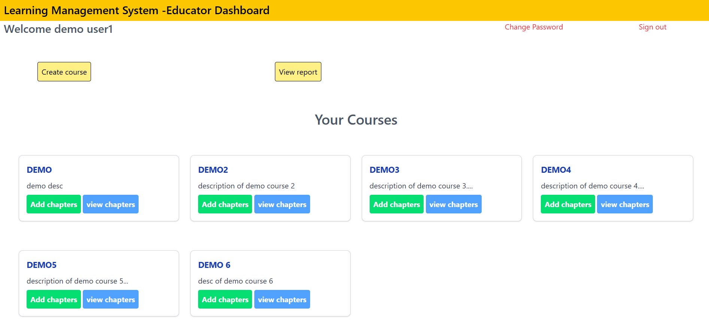
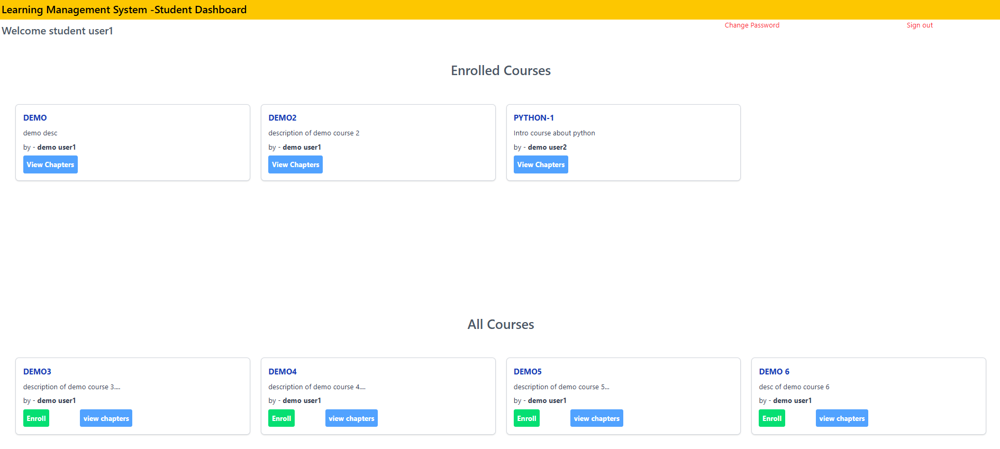

# 📚 Learning Management System (LMS)

A full-stack web application that allows educators to create courses with chapters and pages, and enables students to enroll, track progress, and complete lessons.

## 🚀 Features

- 👨‍🏫 Educator Dashboard:
  - Create, edit, and manage courses
  - Add chapters and pages to courses
  - View enrolled students count.

- 🧑‍🎓 Student Dashboard:
  - Enroll in available courses
  - Navigate through lessons
  - Mark lessons as complete and track progress

- 🔐 Authentication:
  - Separate logins for educators and students
  - Secure session handling with Passport.js

## 🛠️ Tech Stack

| Category        | Technologies                        |
|----------------|-------------------------------------|
| Backend         | Node.js, Express.js                 |
| Frontend        | EJS, HTML, CSS                      |
| Database        | PostgreSQL, Sequelize ORM           |
| Authentication  | Passport.js, bcrypt                 |
| Middleware      | express-session, connect-flash, CSRF protection |

## 📸 Screenshots

### 👨‍🏫 Educator Dashboard

### 🧑‍🎓 Student Dashboard

